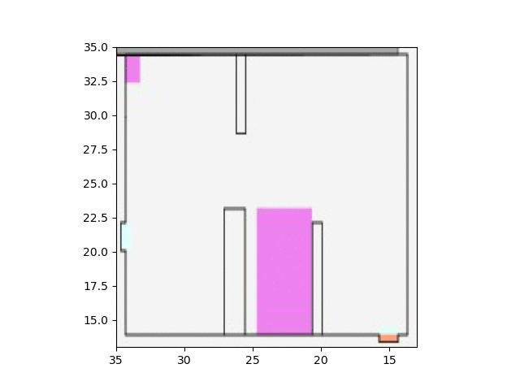
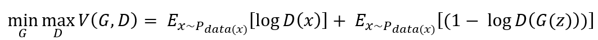
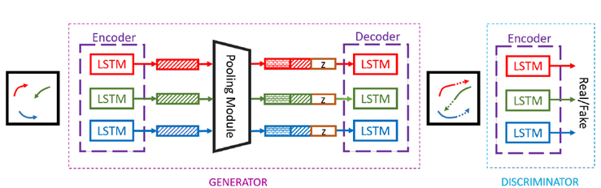

# AI-supported Pedestrian routing

## Scope

This project is conducted in the scope of the course "BV030004 - Software Lab" in the academic year 2021

## Abstract & Motivation

Understanding human motion behavior is of an intensive use for various end-user applications like urban safety, city planning, and marketing to name a few. The aim of this project is to develop a neural network for predicting the pedestrian behavior and walking routes in different scenarios with a less computational cost. Moreover, successful training of deep networks requires many thousands of training samples. To reach this goal, we used MomenTUM simulator to generate reliable and sufficient data to train our model. Given a history of human motion paths, there are many socially plausible ways that people could move in the future. We tackle this problem by combining tools from sequence prediction and generative adversarial networks.

</img>

## Network Architecture

A Generative Adversarial Network (GAN) consists of two neural networks trained in opposition to each other. The two adversarially trained models are: a generative model G that captures the data distribution, and a discriminative model D that estimates the probability that a sample came from the training data rather than G. The generator G takes a latent variable z as input, and outputs sample G(z). The discriminator D takes a sample x as input and outputs D(x) which represents the probability that it is real. The training procedure is similar to a two-player min-max game with the following objective function:
/n

</img>

/n

</img>

## Code Setup

All Code is developed with python 3.9 and Pytorch 1.10

## Pretrained Models

You can find pretrained models in the folder `models`. The folder contains the following models:

- `Queue_model.pt`: Contains pretrained model for the queue dataset. In this model the 'standing in a queue' behavior is trained and captured.
- `entrance_model.pt`: Contains pretrained model for the entrance dataset. In this model 'entering the scene and heading to a destination' behavior is trained and captured.
- `intermediate.pt`: Contains pretrained model for the entrance behavior dataset.  In this model 'entering the scene and heading to a destination' behavior is trained and captured.

Please refer to [this file](RESULTS.md) for results.

## Training new models

A guideline for training new models can be [found here](TRAIN.md)

## Visualizing results

A guideline for visualization can be [found here](VISUALIZE.md)

## Additional information

### Authors

Beshoy Fawzy and Syed Salman Ahmed

Technical University of Munich

### Supervisors

Jan Clever and Ann-Kristin Dugstad

Chair of Computational Modeling and Simulation

Technical University of Munich

### References

* https://github.com/agrimgupta92/sgan
* https://github.com/crowdbotp/socialways
