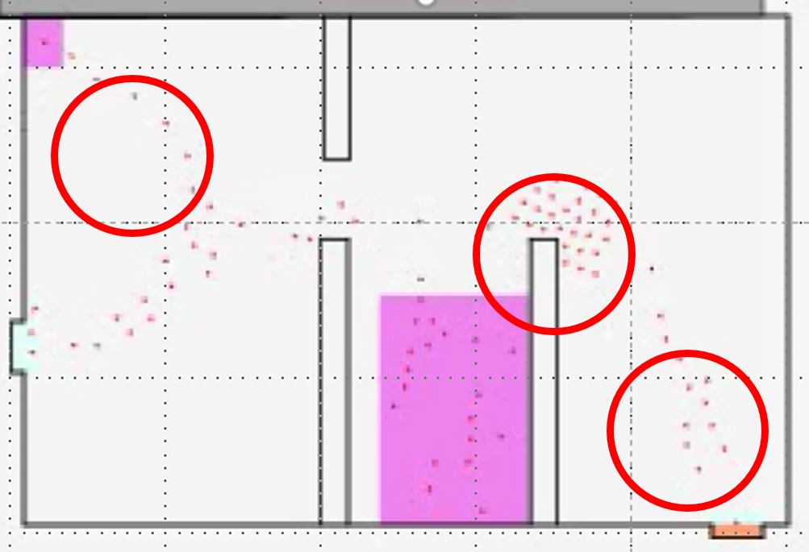

# Training Instructions

## Step 1: MomenTUM data preparation

The data generated from MomenTUM simulator entails different behaviors. For example, in the same time step there are different agents in the scene with different movement intentions, such as heading to some destination, standing in a queue, or avoiding some obstacle or other pedestrians. To simplify the problem we chose data subsets that represent specific behaviors for training the model, as shown in the below picture. Each circle demonstrates a specific behavior.

<div align='center'>
</img>
</div>

For datasets reproduction, you can use the script create_dataset.py. What you have to do is to specify the dataset path (raw dataset coming from MomenTUM, please see an example in the folder momentum_data ), and give the coordinates of the area (maximum and minimum x and y coordinates) that includes the behavior you want to train.

## Step 2: Train a model

Now you can train a new model by running the script:

```bash
python scripts/train.py
```

By default this will train a model on entrance_data dataset, periodically saving checkpoint files `checkpoint_with_model.pt` and `checkpoint_no_model.pt` to the current working directory. The training script has a number of command-line flags that you can use to configure the model architecture, hyperparameters, and input / output settings:

### Optimization

- `--batch_size`: How many sequences to use in each minibatch during training. Default is 64.
- `--num_iterations`: Number of training iterations. Default is 10,000.
- `--num_epochs`: Number of training iterations. Default is 200.

### Dataset options

- `--dataset_name`: The dataset to use for training; must be either of the five supported datasets. Default is `entrance_data`.
- `--delim`: Delimiter used in the files of the dataset. Default is ' '.
- `--obs_len`: Number of time-steps in input trajectories. Default is 8.
- `--pred_len`: Number of time-steps in output trajectories. Default is 8.
- `--loader_num_workers`: The number of background threads to use for data loading. Default is 4.

### Model options

Our model consists of three components 1) Generator 2) Pooling Module 3) Discriminator. These flags control the architecture hyperparameters for both generator and discriminator.

- `--embedding_dim`: Integer giving the dimension for the embedding layer for input (x, y) coordinates. Default is 64.
- `--num_layers`: Number of layers in LSTM. We only support num_layers = 1.
- `--dropout`: Float value specifying the amount of dropout. Default is 0 (no dropout).
- `--batch_norm`: Boolean flag indicating if MLP has batch norm. Default is False.
- `--mlp_dim`: Integer giving the dimensions of the MLP. Default is 1024.
We use the same mlp options across all three components of the model.

**Generator Options**: The generator takes as input all the trajectories for a given sequence and jointly predicts socially acceptable trajectories. These flags control architecture hyperparameters specific to the generator:

- `--encoder_h_dim_g`: Integer giving the dimensions of the hidden layer in the encoder. Default is 64.
- `--decoder_h_dim_g`: Integer giving the dimensions of the hidden layer in the decoder. Default is 128.
- `--noise_dim`: Integer tuple giving the dimensions of the noise added to the input of the decoder. Default is None.
- `--noise_type`: Type of noise to be added. We support two options "uniform" and "gaussian" noise. Default is "gaussian".
- `--noise_mix_type`: The added noise can either be the same across all pedestrians or we can have a different per person noise. We support two options "global" and "ped". Default value is "ped".
- `--clipping_threshold_g`: Float value indicating the threshold at which the gradients should be clipped. Default is 0.
- `--g_learning_rate`: Learning rate for the generator. Default is 0.001.
- `--g_steps`: An iteration consists of g_steps forward backward pass on the generator. Default is 1.

**Pooling Options**: Our design is general to support any pooling type. We support two pooling modules: 1) Social Pooling 2) Pool Net. These flags control architecture hyperparameters specific to pooling modules:

- `--pooling_type`: Type of pooling module to use. We support two options "pool_net" and "spool". Default is "pool_net".
- `--pool_every_timestep`: We can pool the hidden states at every time step or only once after obs_len. Default is false.
- `--bottleneck_dim`: Output dimensions of the pooled vector for Pool Net. Default is 1024.
- `--neighborhood_size`: Neighborhood size to consider in social pooling. Please refer to S-LSTM paper for details. Default is 2.
- `--grid_size`: The neighborhood is divided into grid_size x grid_size grids. Default is 8.

**Discriminator Options**: These flags control architecture hyperparameters specific to the discriminator:

- `--d_type`: The discriminator can either treat each trajectory independently as described in the paper (option "local") or it can follow something very similar to the generator and pool the information across trajectories to determine if they are real/fake (option "global"). Default is "local".
- `--encoder_h_dim_d`:  Integer giving the dimensions of the hidden layer in the encoder. Default is 64.
- `--d_learning_rate`: Learning rate for the discriminator. Default is 0.001.
- `--d_steps`: An iteration consists of d_steps forward backward pass on the generator. Default is 2.
- `--clipping_threshold_d`: Float value indicating the threshold at which the gradients should be clipped. Default is 0.

### Output Options

These flags control outputs from the training script:

- `--output_dir`: Directory to which checkpoints will be saved. Default is current directory.
- `--print_every`: Training losses are printed and recorded every `--print_every` iterations. Default is 10.
- `--timing`: If this flag is set to 1 then measure and print the time that each model component takes to execute.
- `--checkpoint_every`: Checkpoints are saved to disk every `--checkpoint_every` iterations. Default is 100. Each checkpoint contains a history of training losses, error metrics like ADE, FDE etc,  the current state of the generator, discriminators, and optimizers, as well as all other state information needed to resume training in case it is interrupted. We actually save two checkpoints: one with all information, and one without model parameters; the latter is much smaller, and is convenient for exploring the results of a large hyperparameter sweep without actually loading model parameters.
- `--checkpoint_name`: Base filename for saved checkpoints; default is 'checkpoint', so the filename for the checkpoint with model parameters will be 'checkpoint_with_model.pt' and the filename for the checkpoint without model parameters will be 'checkpoint_no_model.pt'.
- `--restore_from_checkpoint`: Default behavior is to start training from scratch, and overwrite the output checkpoint path if it already exists. If this flag is set to 1 then instead resume training from the output checkpoint file if it already exists. This is useful when running in an environment where jobs can be preempted.
- `--checkpoint_start_from`: Default behavior is to start training from scratch; if this flag is given then instead resume training from the specified checkpoint. This takes precedence over `--restore_from_checkpoint` if both are given.
- `--num_samples_check`: When calculating metrics on training dataset limit the number of samples you want to evaluate on to ensure checkpointing is fast for big datasets.
