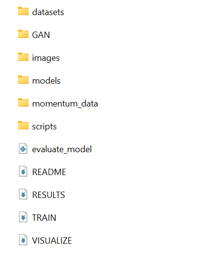
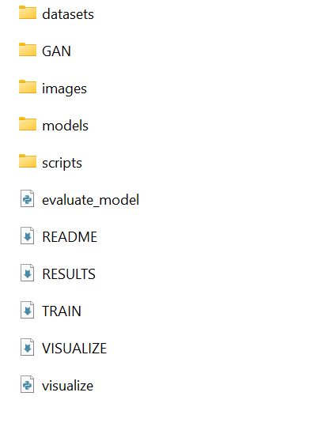
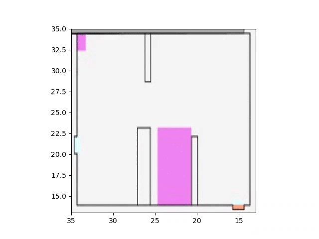

# Visual-of-Social-GAN
Show Visualization Result of Social GAN

1.make sure that the models, and the datasets in folders like this:

</img>

2.put visualize.py it in your folder like this

</img>

3.input 'python visualize.py --model_path models\entrance..'

</img>

done!